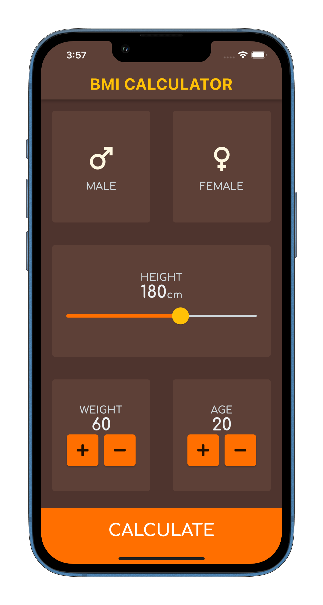
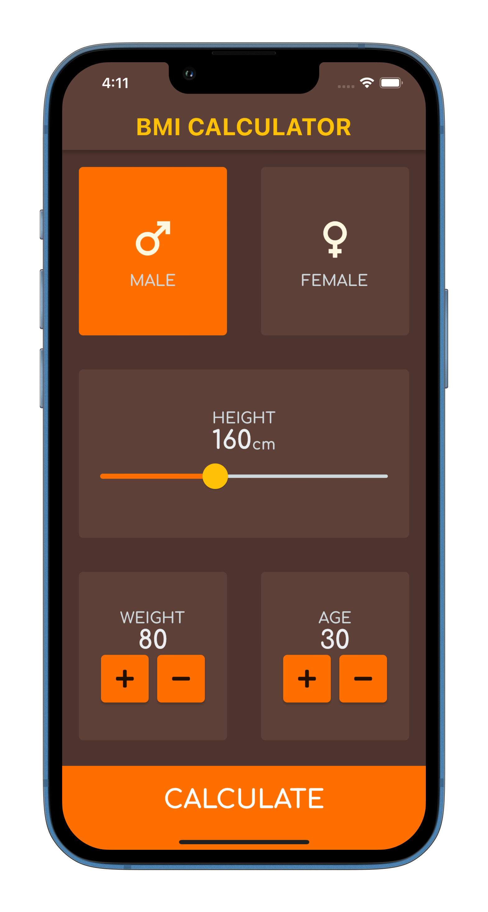

# BMI CALCULATOR

## Project Description 
A flutter application that calculates your Body Mass Index.

## Some ScreenShots

## Project Details
Having studied the flutter and dart ecosystem for a month, this was my first project.
## Technologies Used

A few resources to get you started if this is your first Flutter project:

- [Flutter](https://flutter.dev)
- [Dart:](https://dart.dev)

For help getting started with Flutter, view the
[online documentation](https://flutter.dev/docs), which offers tutorials,
samples, guidance on mobile development, and a full API reference.
